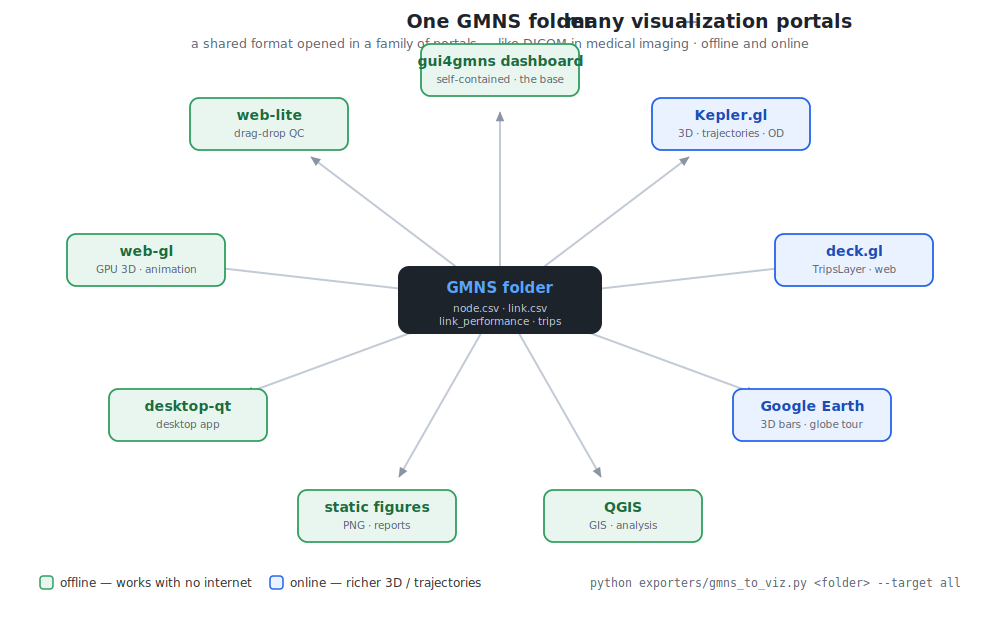

# gui4gmns

[](https://asu-trans-ai-lab.github.io/gui4gmns/)
[](https://asu-trans-ai-lab.github.io/gui4gmns/gallery.html)
[](LICENSE)
[](pyproject.toml)

*(in the `*4gmns` family alongside plot4gmns / path4gmns / osm2gmns)*

**AI-guided dashboards for GMNS: DTALite · TAPLite · Dynamic ODME · DLSim.**
GMNS run folder in → one self-contained, offline-capable `dashboard.html` out. No install to view,
no editing to learn — the legacy NEXTA GUI stays the editor; this is the modern viewer + generator.

**gui4gmns** is the project name — the pip-installable generator core plus its viewers. It is the
cross-platform successor of the Windows-only MFC NEXTA GUI (formerly branded *gui4gmns*), rebuilt on
one shared data contract with an AI-guided generator at its core. See `NAMING.md`.

## Quickstart
```bash
# 1) generate a dashboard from any GMNS folder (pure-Python core, no deps)
python ai-gen/gui4gmns.py datasets/01_sioux_falls          # -> datasets/01_sioux_falls/dashboard.html
#    options: --basemap osm|satellite|none   --max-traj N   --single

# 2) or import it, like plot4gmns
python -c "import sys; sys.path.insert(0,'ai-gen'); from gui4gmns import generate; generate('datasets/01_sioux_falls')"

# 3) open the dashboard (double-click, or serve for the basemap)
python -m http.server 8765   # then browse to datasets/01_sioux_falls/dashboard.html
```

## What a generated dashboard gives you
- **Network map** with MOE coloring/bandwidth: volume · V/C · queue · time-dependent flow · **QVDF speed**
- **Hybrid basemap**: OSM network-wide, **satellite** as you zoom into detail — both embedded (offline)
- **Animation**: play/scrub 15-min bins; vehicle dots (green moving / red queued) from trajectories
- **Demand OD desire lines + demand matrix heatmap** and **attribute distributions** (learned from
  plot4gmns — see `ai-gen/LEARNINGS_FROM_PLOT4GMNS.md`)
- **Corridor speed contour**: INRIX-observed vs QVDF-model space-time, with RMSE / R² / bias validation
- **Data-quality audit** in every dashboard (MOE coverage, conservation, oversaturation, suspicious
  zero-volume major links, connector sentinels) — it checks its own inputs
- **Split lightweight layer files** (`dashboard_layers/*.js`) so each layer is inspectable & regenerable

## Repository layout (this is the canonical home — release + continuous updates happen here)
```
ai-gen/                the generator core (gui4gmns.py) + VIZ_SCHEMA + design studies
nexta_x.html           web-lite viewer (zero-install, drag-drop)
web-gl/                GPU viewer (regional-scale animation, live-follow)
desktop-qt/            Qt desktop app (Run engine button, basemaps, headless snapshots)
engine/DLSim_STE/      the DLSim space-time-event engine (C++17 source + toy testdata; build.sh)
engine/bin/            local binaries (git-ignored; build from source or copy dlsim_run.exe here)
datasets/              public samples: 01 Sioux Falls · 02 Chicago Sketch · 05 toys · 07 West Jordan
docs/                  Users Guide (md + pdf)
SHARED_CONTRACT.md     the one data contract every branch implements
```
Provenance: consolidated 2026-07 from the `dtalite/` (gui4gmns, DLSim_STE), the DTALite/TAPLite C++
kernel workspace, and `dynamic_ODME/` sample sets, so releases happen in ONE place. Heavy kernels stay
in their dev homes: DTALite/TAPLite C++ → `dtalite_with_taplite_Cpp_kernel/` · large networks →
`asu-trans-ai-lab/dynamic-odme-lab`.

## The viewers (one shared contract, `SHARED_CONTRACT.md`)
| branch | file | for |
|---|---|---|
| **AI-Gen** | `ai-gen/gui4gmns.py` | the core: preprocess + generate self-contained dashboards |
| **web-lite** | `nexta_x.html` | zero-install QC: drag-drop GMNS files in any browser |
| **web-gl** | `web-gl/nexta_xgl.html` | GPU animation at regional scale + live-follow of a running sim |
| **desktop-qt** | `desktop-qt/nexta_qt.py` | desktop app: open folders, **Run engine**, basemap, snapshots |

## Visualization portals — online + offline



GMNS is a shared exchange format — think **DICOM in medical imaging**: you don't read the raw file, you open
it in a *portal*. gui4gmns opens one GMNS folder in a whole family of them. **Offline** (no internet): the
dashboard, web-lite, web-gl, desktop-qt, QGIS, Google Earth Pro, static figures. **Online** (richer 3D +
trajectories): **Kepler.gl**, **deck.gl**, **Google Earth**. One command exports outward to all four:
```bash
python exporters/gmns_to_viz.py <gmns_folder> --target all    # -> kepler + deckgl + qgis + kml, each with a README
```
Every generated dashboard **auto-writes** a `portals/` folder beside it (kepler/deckgl/qgis/kml) — one run,
every portal (`--no-portals` to skip). Full guide — what each portal is for, 3D & trajectories, and how
**students swap in their own datasets**: **[docs/VISUALIZATION_PORTALS.md](docs/VISUALIZATION_PORTALS.md)**.

**▶ Live demo** (no install — opens in your browser): a deck.gl view of the Chicago Sketch network at
**https://asu-trans-ai-lab.github.io/gui4gmns/portal_demo/** · browse the gallery at
**https://asu-trans-ai-lab.github.io/gui4gmns/gallery.html**.

## Data policy
This repository ships the generator, viewers, and **public** sample networks only. Agency data
(NVTA / VDOT / INRIX / CBI and any QVDF corridor derived from them) is **never** committed — it is
git-ignored via `*PRIVATE*` / `*nvta*` rules. Large public networks (ARC Atlanta, Chicago Regional)
are referenced from `asu-trans-ai-lab/dynamic-odme-lab` rather than duplicated here. Run
`python validate_no_private_data.py` before any commit.

Sample-data attribution: Sioux Falls / Chicago from bstabler/TransportationNetworks; basemap tiles ©
OpenStreetMap contributors and Imagery © Esri, Maxar, Earthstar Geographics (embedded per their terms).
The local-only ITS I-95 (VA) data-hub demo is sourced from the USDOT JPO CodeHub **Data Cleaning and
Fusion Tool** (https://github.com/usdot-jpo-codehub/data-cleaning-and-fusion-tool); its INRIX/VDOT/probe
layers are restricted and never committed.

## Docs
[`docs/VISUALIZATION_PORTALS.md`](docs/VISUALIZATION_PORTALS.md) (online+offline portals, 3D/trajectories,
student how-to) · `docs/gui4gmns_Users_Guide.md` · `SHARED_CONTRACT.md` · `REFACTOR_PLAN.md` ·
`ai-gen/VIZ_SCHEMA.md` (build your own dashboard, AI-guided) · `ai-gen/LEARNINGS_FROM_PLOT4GMNS.md`.
