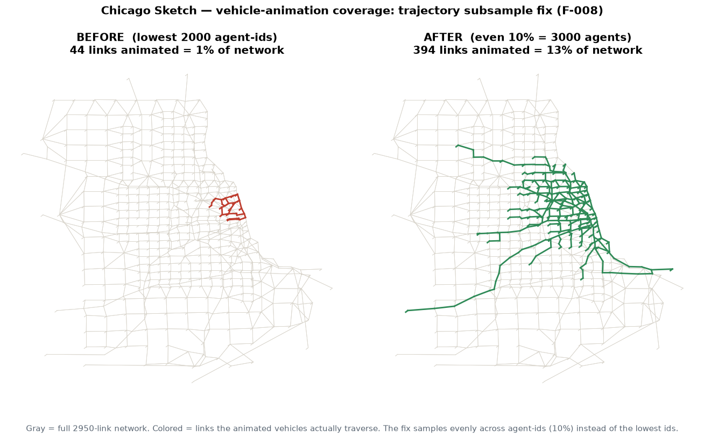
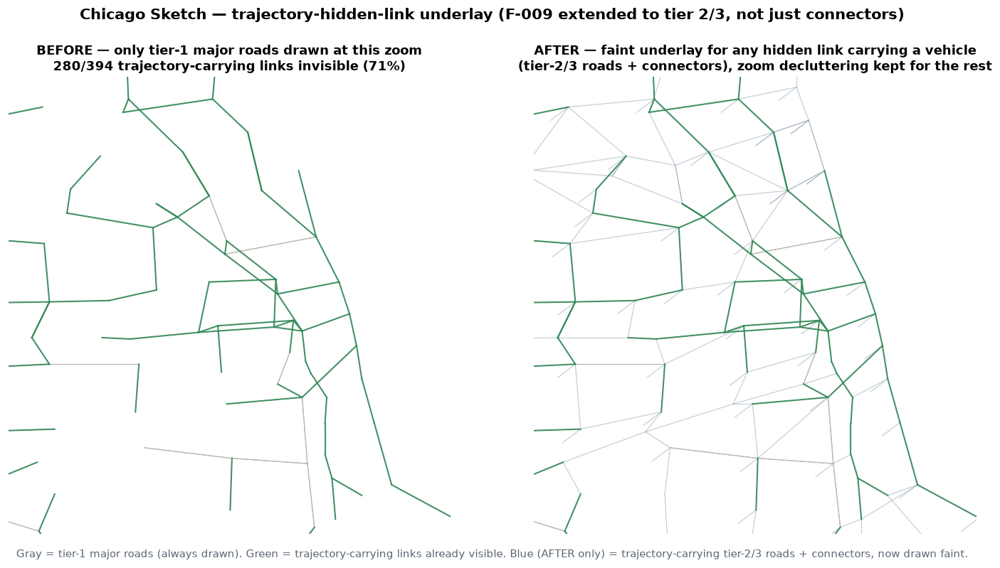

# QA fixes — 2026-07-07

Fixes applied during Phase 2 QA of the public showcase, with the problem, the root cause, the exact
change, and the measured effect. Findings tracked in `qa/qa_report.html` (F-006 … F-008).

The theme: a dashboard that *generates without error* is not the same as a dashboard that *shows the
user something meaningful*. These were caught by checking the actual output from a user's seat, not
just the exit code.

---

## Fix 1 — Vehicle animation collapsed into 1% of the network  (F-008, code fix)

**Problem (what the user sees).** On Chicago Sketch (2950 links) the animated vehicles cluster in one
tiny area near downtown; the rest of the network shows no moving vehicles, even though it clearly
carries traffic.

**Before / after.** Same 2000 sampled agents in both panels. Gray = full network; colored = links the
animated vehicles actually traverse.



| | agents animated | links animated | % of network |
|---|:-:|:-:|:-:|
| **Before** (lowest 2000 ids) | 2000 | 44 | 1% |
| **After** (even 10% spread) | 3000 | 394 | 13% |

**Root cause.** `ai-gen/gui4gmns.py` (`load()`) subsampled trajectories with `if agent_id >= max_traj:
continue` — i.e. it kept the **2000 lowest agent ids**, not a representative sample. Agent ids are
assigned by origin zone / departure order, so the lowest ids are spatially clustered. The file holds
30,000 agents; keeping ids 0–1999 touched only 44 links.

**Two changes.**
1. **Representative sample** — keep agents spread **evenly across the sorted id space**, not the lowest ids.
2. **Percentage, not a flat count** — animate **~10% of the run's agents** (a flat 2000 was too few for a
   30k-agent sample), capped at `max_traj` (default raised 2000 → 10 000) so very large runs stay small.

```python
# after
all_ids = sorted({int(fnum(r["agent_id"])) for r in tj})
target = min(max_traj, max(1, round(0.10 * len(all_ids))))   # ~10%, capped
if len(all_ids) > target:
    step = len(all_ids) / target
    keep = {all_ids[int(i * step)] for i in range(target)}
else:
    keep = set(all_ids)
```

**Effect.** Chicago now animates 3000 agents (10% of 30 000) spanning ids 0–29 985 and covering **394
links (13%) vs 44 (1%)** — ~9× more of the network. File ~0.64 MB (was 0.43 MB), still well offline.
Datasets with fewer agents than the target keep all of them, as before.

---

## Fix 2 — Animated vehicles float off the network  (F-009, render fix)

**Problem (what the user sees).** Even with a good trajectory sample, many moving vehicles / trail
segments appear to run through **empty space**, not on any drawn road.

**Before / after.**



**Root cause — two compounding causes, both "real link, not drawn":**

1. **Centroid connectors** — virtual links joining a zone centroid to the real road it feeds. Correctly
   left unlabeled/undrawn among the road tiers (tier 4), but **~45% of trajectory hops traverse one**
   (a trip starts and ends on one).
2. **Zoom-based LOD (level of detail).** Real roads are split into tiers by capacity — tier 1 "major"
   (top 15%) draws at any zoom; tier 2 "middle" only draws once zoomed to 2.5×; tier 3 "minor" only at
   8×. This is intentional decluttering (`zTier=zoom<2.5?1:zoom<8?2:3`) — but trajectories don't respect
   it. At the default zoom, **18% of hops are on tier-2 roads and 6% on tier-3**, all real, all in
   `link.csv`, just not drawn yet.

Combined: on Chicago's 10%-sample, **394 links carry animated vehicles, and 280 of them (71%) were
invisible at the default zoom** — 107 connectors + 136 tier-2 + 37 tier-3.

**The change (`draw()` in the embedded JS).** Precompute once which links carry a loaded trajectory
(`M.trajLinks`), then — only for links a vehicle is actually on, and only when hidden by the current
tier/zoom — draw them as a thin, dim underlay:

```js
// once, at load:
M.trajLinks = new Set();
for (const k in M.trajs) for (const ev of M.trajs[k]) M.trajLinks.add(ev[1]);

// every draw() call:
if (M.trajLinks.size) {
  ctx.strokeStyle = 'rgba(150,162,178,0.22)'; ctx.lineWidth = 0.7;
  M.links.forEach(L => {
    const t = L[6] || 3;
    if ((t > zTier || t === 4) && M.trajLinks.has(L[0])) path(L);
  });
}
```

**Effect.** Every animated vehicle now sits on a visible (faint) path. The zoom-based declutter still
applies to the ~1400 tier-2/3 roads that carry **no** trajectory — only the 280 that do get lit up, so
the map doesn't revert to "draw everything." Network-only views (no trajectories, e.g. Sioux Falls)
are unchanged; toy datasets and a no-trajectory smoke test regenerate identically to before.

## Fix 3 — Quickstart produced an empty dashboard / didn't run at all  (F-007, docs fix)

**Problem (what the user sees).** Three distinct ways the advertised quickstart let a new user down:

1. `pip install gui4gmns` then `gui4gmns datasets/01_sioux_falls` → **fails** with `need node.csv +
   link.csv`. The pip package ships **code only** — the `datasets/` folder does not exist next to a
   pip-installed package.
2. Even from a repo clone, `datasets/01_sioux_falls` ships only `node/link/demand.csv` — **no
   link_performance, no trajectories** — so the dashboard is a bare network: no MOE colors, no moving
   vehicles. A new user's first run looks empty.
3. On locked-down Windows the `gui4gmns` **console command is blocked** ("Access is denied" — the
   generated `.exe` shim is quarantined by endpoint security), with no hint of the `python -m` fallback.

**The change (`README.md` Quickstart).**
- Point the install-and-run path at **`path/to/gmns_folder`** (the user's own data), and state plainly
  that the pip package ships code only — clone the repo for sample datasets.
- Lead the sample run with **`datasets/02_chicago_sketch`** (animated vehicles + congestion + portals),
  and label `01_sioux_falls` explicitly as a *minimal network-only* example.
- Add the **`python -m gui4gmns …`** module form as the fallback when the console command is blocked.

**Effect.** The first command a newcomer runs now produces a rich, obviously-working dashboard, and the
pip-only path no longer dead-ends on a missing `datasets/` folder.

---

## Still open — needs Prof. Zhou's call (not auto-fixed)

## F-006 — Chicago corridor space-time contour renders empty
`DATASETS_COVERAGE.md` lists Chicago Sketch with space-time contour ✓, but the dataset ships no
`corridor_speed.csv` (what the contour reads), so `corridor.js` is empty. Two clean options, both a
judgment call about the showcase rather than a bug to silently fix:
1. ship a small public `corridor_speed.csv` for Chicago so the contour renders, or
2. mark the contour `–` for Chicago in the coverage table and demo it on the I-210E corridor trio,
   which already ships the input.

---

## Suggested QA methodology upgrade (from these findings)

Add two **"meaningful output"** checkpoints to the matrix so this class of issue is caught mechanically,
not by eye:

- **O — effective output:** any capability a dataset claims must render **non-empty and non-degenerate**.
  Thresholds: trajectories present ⇒ animation covers ≥ ~10% of links (not 1%); MOE present ⇒ volume
  spread across the network; corridor claimed ⇒ `corridor.js` non-empty. (Would have caught F-006 and F-008.)
- **P — first-run experience:** every dataset named in the README quickstart must produce a visibly
  non-empty dashboard (colored MOE or moving vehicles). (Would have caught F-007.)
